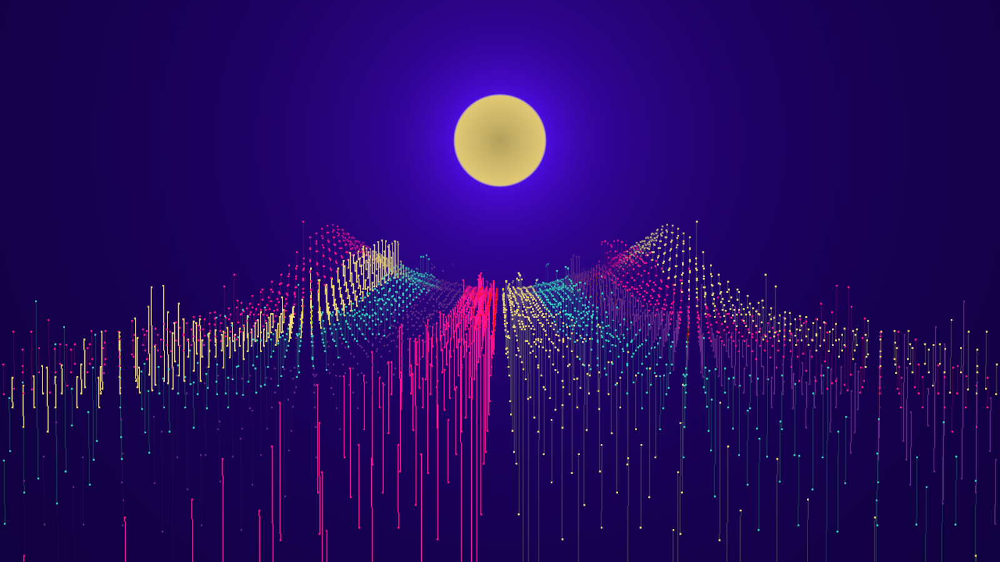
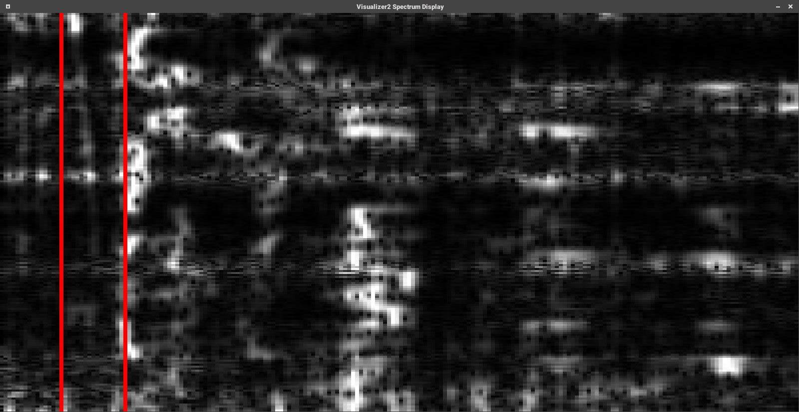

visualizer2
===========

Audio-Visualization in Rust.  *visualizer2* is my second (actually third) attempt at creating pretty visuals that somehow behave in sync with a live audio signal.  The first attempt can be found [here](https://github.com/Rahix/pa-visualizer).

## Visualizers
There are a few ready to use visualizers in this repository:

### noambition
Based on the *noambition* visualizer from [pa-visualizer](https://github.com/Rahix/pa-visualizer), which in turn is based on the demo [No Ambition](http://www.pouet.net/prod.php?which=69730) by Quite & T-Rex.  That said, this version no longer has a lot of similarities ...



### noa-35c3
Version of *noambition* that was adapted for 35c3.


### no-midi
A visualizer which sends MIDI commands.  These MIDI commands can be fed into a lighting controller to then control fancy event lighting equipment.

Check the [no-midi README](./no-midi/README.md) for more info.

### spectral
A debug spectral display.



## Project Structure
The core concept of *visualizer2* is the following:  The [`vis-core`](./vis-core) crate contains all the glue logic and building blocks for analyzing the audio signal.  The goal is that creating a new visualizer needs as little boilerplate as possible.  In practice, the following code is all you need to get started:

```rust
// The data-type for storing analyzer results
#[derive(Debug, Clone)]
pub struct AnalyzerResult {
    spectrum: vis_core::analyzer::Spectrum<Vec<f32>>,
    volume: f32,
    beat: f32,
}

fn main() {
    // Initialize the logger.  Take a look at the sources if you want to customize
    // the logger.
    vis_core::default_log();

    // Load the default config source.  More about config later on.  You can also
    // do this manually if you have special requirements.
    vis_core::default_config();

    // Initialize some analyzer-tools.  These will be moved into the analyzer closure
    // later on.
    let mut analyzer = vis_core::analyzer::FourierBuilder::new()
        .length(512)
        .window(vis_core::analyzer::window::nuttall)
        .plan();

    let spectrum = vis_core::analyzer::Spectrum::new(vec![0.0; analyzer.buckets], 0.0, 1.0);

    let mut frames = vis_core::Visualizer::new(
        AnalyzerResult {
            spectrum,
            volume: 0.0,
            beat: 0.0,
        },
        // This closure is the "analyzer".  It will be executed in a loop to always
        // have the latest data available.
        move |info, samples| {
            analyzer.analyze(samples);

            info.spectrum.fill_from(&analyzer.average());
            info.volume = samples.volume(0.3) * 400.0;
            info.beat = info.spectrum.slice(50.0, 100.0).max() * 0.01;
            info
        },
    )
    // Build the frame iterator which is the base of your loop later on
    .frames();

    for frame in frames.iter() {
        // This is just a primitive example, your vis core belongs here

        frame.lock_info(|info| {
            for _ in 0..info.volume as usize {
                print!("#");
            }
            println!("");
        });
        std::thread::sleep_ms(30);
    }
}
```

## Architecture
In live mode, *visualizer2* runs three loops:

1. The **recorder**, which acquires samples from somewhere (pulseaudio by default) and pushes them into the sample-buffer.
2. The **analyzer**, which calculates some information from the sample-buffer.  Common are spectral analysis or beat-detection.  The *analyzer* is actually written by **you**, so you have maximum freedom with what you need.
3. The **renderer**, which is the applications main thread.  Here you consume the latest info from the *analyzer* and create visuals with it.

### Recorder
By default, *visualizer2* uses *pulseaudio*, but it is really easy to use another audio source.  You just have to implement an alternative recorder.  For an example take a look at the `pulse` recorder.

### Analyzer
The *analyzer* consists of a closure and a data-type that contains all info shared with the *renderer*.  There are a few things to note:

* To enable lock-free sharing of the info, the info-type needs to be `Clone`.
* While the analyzer gets an `&mut info`, you can **not** make any assumptions about its contents apart from it being filled with either the initial value or the result of *some* (most likely **not** the last!) analyzer run.
* If you need data from the last analyzer run, you have to keep track of that locally, easiest by capturing a variable in the analyzer closure.

### Renderer
This part is completely up to you.  `vis-core` gives you an iterator that you should trigger once a frame and that allows access to the info from the analyzer.  In most cases you will be using a loop like this:

```rust
for frame in frames.iter() {
    println!("Frame: {}", frame.frame);
    println!("Time since start: {}", frame.time);
}
```

## Configuration
During the process of writing multiple different versions of this system I also wrote [`ezconf`](https://github.com/Rahix/ezconf).  This is now the configuration system used in all parts of `vis-core`.  The design philosophy is the following:

* Components (like a `FourierAnalyzer` or a `BeatDetector`) are created using a builder pattern.
* All fields not explicitly set with the builder will be read from the configuration source.  This allows easily changing parameters without recompiling each time.

Additionally, the final configuration will be logged in debug builds.

I encourage using the same system for your graphics code because it allows quickly iterating on certain settings which is more fun than waiting for the compiler each time.  To use the config:

```rust
let some_configurable_setting = vis_core::CONFIG.get_or(
    // Toml path to the value
    "myvis.foo.bar",
    // Default value, type will be inferred from this
    123.456
)
```

### Config Source
By default, when calling `vis_core::default_config()`, `vis-core` searches for a file named `visualizer.toml` in the current working directory.  If you want a different file to be used, you can instead initialize the config yourself manually.


## Analyzer Tools
`vis-core` includes a few tools for analyzing the audio signal.  Look at each ones docs for more info:

* [`FourierAnalyzer`](./vis-core/src/analyzer/fourier.rs) - Does a fourier transform on the latest samples and returns a spectrum
* [`Spectrum`](./vis-core/src/analyzer/spectrum.rs) - A flexible representation of a spectrum.  Has methods for taking a subspectrum (`slice`), filling into a smaller number of buckets (`fill_buckets`), and finding maxima (`find_maxima`).  There is also `average_spectrum` to average multiple spectra.
* [`BeatDetector`](./vis-core/src/analyzer/beat.rs) - A beat detector that allows triggering certain effects as soon as a beat happens.  Tries to introduce as little delay as possible!

## License

*visualizer2* is licensed under the `GNU General Public License v3.0 or later`.  See [LICENSE](LICENSE) for more info.
